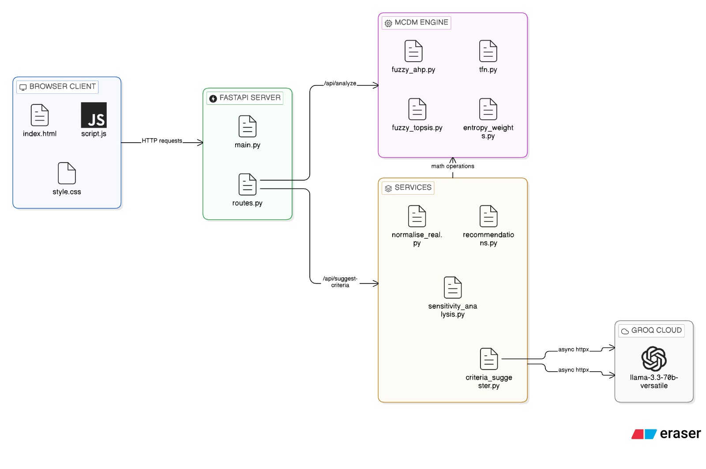
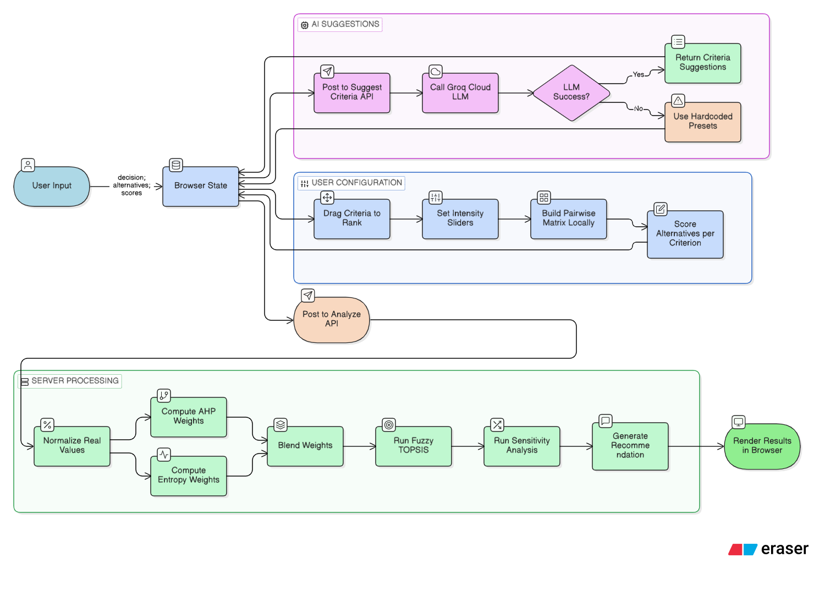

# Decision Support System — Build Process

> *"A system that supports structured human decision-making — not merely computes rankings."*

---

## Purpose of This Document

This document narrates the complete intellectual and technical journey behind the Decision Support System — from a baseline scoring tool to a hybrid, uncertainty-aware decision intelligence platform.
---

## Core Design Philosophy

Most decision-support tools frame the challenge as a computation problem: gather inputs, apply weights, output a score. The core problem, however, is fundamentally human in nature.

> **The Core Insight:** Decision-makers do not just need the best answer — they need confidence in the decision. This shift changes everything: the input model, the output format, the role of AI, and the definition of a correct result.

**Three ambiguities identified up front:**

- Users may not know which criteria are relevant to their decision.
- Users cannot reliably assign precise numerical weights to abstract concepts.
- Real-world alternatives carry data uncertainty, not just subjective scores.

**System Goal:** The system is designed to guide structured thinking first and compute rankings second. Every subsequent technical decision was evaluated against this goal.

---

## 01 | Starting Point — Simple Additive Weighting (SAW)

The initial implementation used Simple Additive Weighting — the simplest viable approach. Criterion values are normalized, multiplied by user-defined weights, summed, and ranked.

**Rationale for SAW as a baseline:**

- Low implementation complexity — a clean foundation for iterative comparison.
- Immediate, interpretable output with minimal setup.
- Forces explicit articulation of model assumptions before any refinement.

**Assumptions SAW requires:**

- Criteria are independent.
- Users already know their weights.
- No way to compare importance between criteria.

> **The Pivotal Question:** "What if the user does not even know what matters and how much?" — This limitation drove every subsequent design iteration.

---

## 02 | First Evolution — Analytic Hierarchy Process (AHP)

To address weight ambiguity, the system adopted the Analytic Hierarchy Process. Rather than asking 'What is the weight of cost?', the method asks 'Is cost more important than performance, and by how much?'

**Alignment with human cognition:** Humans reason comparatively, not in percentages. AHP encodes this naturally. Pairwise comparisons produce a matrix; eigenvector normalization extracts weights; the Consistency Ratio (CR) validates logical coherence.

**Why this helped:**

- More natural for human thinking.
- Captures relative importance.
- More accurate representation of user intent.
- Reduced arbitrary weighting.

**Limitation:**

- Uses crisp values (exact numbers like 3, 5, 7).
- Human judgment is often uncertain.

> **Trade-Off Accepted:** AHP requires O(n²) comparisons and produces crisp weights — still exact, still rigid. For six criteria, users face fifteen pairwise comparisons. This was an improvement, but cognitive load remained a concern.

---

## 03 | Handling Human Ambiguity — Fuzzy AHP

A consistent pattern emerged when users engaged with AHP: 'Cost is more important, but whether it is 3x or 5x more important is uncertain.' Exact scalar inputs felt artificially precise.

**Impact:**

- Captures uncertainty in human judgment.
- Allows "approximate importance" instead of exact values.

**Technical decision — Triangular Fuzzy Numbers (TFN):** Scalar comparison values were replaced with fuzzy triplets (lower, middle, upper). Each judgment becomes a range rather than a fixed point.

- `tfn_mul`, `tfn_add`, `tfn_recip` — fuzzy arithmetic operations.
- `defuzz()` — collapses fuzzy weights back to crisp values for final scoring.

> **Design Insight — Precision Is Not Always Accuracy:** Forcing precision onto an uncertain judgment does not improve accuracy — it produces a precisely wrong result. Fuzzy logic captures the actual state of the decision-maker's knowledge.

**Safeguard retained:** The Consistency Ratio is computed on the defuzzified matrix to ensure logical coherence is preserved even with fuzzy inputs.

**Remaining problem — subjective bias still exists:** Even with Fuzzy AHP, all weights come from user perception with no grounding in actual data.

---

## 04 | Reducing Bias — Entropy-Based Objective Weighting

Fuzzy AHP improved input realism, but weights remained entirely user-derived. A critical failure mode was identified: systematically biased user intuitions produce systematically biased outputs.

**Entropy weighting — core principle:** Criteria with high variation across alternatives carry more discriminative information. Entropy quantifies this property and converts it into objective weights.

- Criteria where alternatives score similarly → low weight (little to distinguish).
- Criteria where alternatives differ widely → high weight (high discriminative power).

### Dual Input Design — A Key Architectural Decision

The entropy module accepts two distinct input types, recognising that not all decision scenarios have access to real-world data.

| Input Type | Example | Preprocessing Before Entropy |
|---|---|---|
| **Real Values** | Price in currency, battery in mAh, processing speed in GHz | Normalized to produce a valid probability-like distribution before entropy is applied. |
| **Slider Ratings** | User rates customer support, ease of use, or brand reputation on a scale | Fed directly into entropy given the bounded scale. No additional normalization required. Entropy measures variation in perceived ratings across alternatives. |

**What entropy measures in each case:** For real values, entropy measures actual discriminative power based on objective magnitudes. For slider ratings, entropy measures variation in perceived scores across alternatives. The entropy calculation is identical in both cases — only the preprocessing differs. This design ensures entropy-based weighting remains valid whether or not objective data is available.

**Edge cases addressed:**

- Zero range across alternatives → uniform distribution fallback to prevent division error.
- Zero sum of diversity values → equal weights fallback to prevent NaN propagation.

> **Why Not Just Use Entropy Alone?** Entropy ignores user intent. A criterion considered strategically paramount may have low data variation in the current alternative set — yet remain critically important. Objective evidence without human judgment is equally incomplete.

---

## 05 | The Core Architecture — Hybrid Weighting

> **Key Design Decision:** Sound decisions are neither purely subjective nor purely objective. The most defensible architecture combines both signals: subjective preference weights from Fuzzy AHP and objective diversity weights from Entropy.

**Why this combination works:**

- Fuzzy AHP alone: accurate human intent, but potentially biased.
- Entropy alone: grounded in data, but blind to strategic priorities.
- Combined: human judgment is checked and balanced by empirical evidence.

This is not a compromise — it is architecturally correct. Good decisions in the real world always integrate both signals.

---

## 06 | Ranking Evolution — Fuzzy TOPSIS

With a more robust weighting model in place, attention returned to the ranking layer. SAW-style scoring aggregates absolute values but ignores where an alternative stands relative to the best and worst possible outcomes.

**Why TOPSIS:** TOPSIS (Technique for Order of Preference by Similarity to Ideal Solution) ranks alternatives by their geometric distance from the Fuzzy Positive Ideal Solution (FPIS) and Fuzzy Negative Ideal Solution (FNIS).

### Iterative Improvements Within TOPSIS

**Normalization upgrade:**

| Before | After |
|---|---|
| `col / max` — risk: outlier values dominate all normalized scores. | `col / √(Σcol²)` — benefit: mathematically stable, magnitude-independent scaling. |

**Dynamic fuzziness:** Old approach used a fixed spread `sp = 0.1` for all criteria. New approach: `sp = std / mean` (coefficient of variation). Criteria with higher data variability receive wider fuzzy membership functions — uncertainty is now data-derived, not assumed.

**Flexible weight input:** The weight handler accepts both scalar and tuple inputs — supporting crisp weights from manual input and fuzzy triplets from Fuzzy AHP. This decouples the weighting module from the ranking module, making both independently replaceable.

---

## 07 | Building Trust — Sensitivity Analysis

A technically sound model can still be fragile. A result that reverses under a ten-percent weight perturbation should not be presented with the same confidence as one that remains stable across a wide perturbation range.

**What the sensitivity module does:**

- Perturbs each criterion weight by ±20% and ±50%.
- Recomputes full TOPSIS rankings under each perturbation.
- Tracks whether the top-ranked alternative changes.
- Outputs: 'Stable decision' or 'Warning — result sensitive to [criterion]'.

> **Design Principle:** A robust system does not just produce answers — it validates them. Sensitivity analysis transforms a ranking into a validated insight, converting blind confidence into informed, evidence-backed confidence.

---

## 08 | AI Integration — Assistive, Not Authoritative

One barrier remained: decision-makers who do not know which criteria to consider face a blank-page problem. An otherwise rigorous decision engine produces unreliable outputs when the criteria are poorly constructed.

**Implementation:** LLaMA 3 via Groq API is integrated to suggest relevant decision criteria based on the stated decision context and listed alternatives.

> **Critical Design Constraint — AI Is Not in the Decision Loop:** AI is used exclusively for criteria suggestion — never for weight calculation, never for ranking logic. This preserves determinism, explainability, and auditability. Suggested criteria can be edited or removed by the decision-maker. The core decision engine is not affected.

**Rationale for excluding AI from core logic:**

- Hallucination risk in weight assignment would silently corrupt results.
- Black-box LLM reasoning cannot be validated with a Consistency Ratio.
- An LLM-derived weight matrix cannot be audited, validated, or overridden with confidence.

---

##  Module Implementation — Step by Step

### Fuzzy AHP
1. User ranks criteria by drag-drop, rates adjacent pairs on 1–9 scale
2. Full n×n matrix built by multiplying neighbor gaps
3. Each crisp value converted to Triangular Fuzzy Number `(l, m, u)`
4. Fuzzy geometric mean per row → normalized to get fuzzy priority weights
5. CR computed on defuzzified matrix — flags inconsistency if `CR ≥ 0.1`

### Entropy Weighting
1. Normalize each criterion column to probability distribution `p_ij = x_ij / Σx_ij`
2. Compute entropy `E_j = -1/ln(m) * Σ p_ij * ln(p_ij)` per criterion
3. Diversity `d_j = 1 - E_j` → normalize to get objective weights
4. Zero-range columns get near-zero weight automatically

### Adaptive Blend
1. `alpha = var(AHP) / (var(AHP) + var(Entropy))`
2. Whichever source discriminates more gets higher influence
3. Combined fuzzy weights normalized component-wise across l, m, u

### Fuzzy TOPSIS
1. Vector normalize matrix `x_ij / √Σx_ij²`
2. Dynamic fuzziness per column: spread `= std/mean`
3. Compute distances from ideal best (FPIS) and worst (FNIS)
4. Closeness `CC = d- / (d+ + d-)` → rank by descending CC

### Real Value Normalisation
1. User enters raw values per alternative per criterion
2. Min-max scaled to 1–9: `score = 1 + ratio * 8`, cost criteria flip ratio
3. Merged into score matrix before pipeline — slider columns untouched

### Sensitivity Analysis
1. Perturb each criterion weight by `[0.8, 0.9, 1.1, 1.2, 1.5]`
2. Renormalize → re-run TOPSIS → check if winner changes
3. Flag criterion Sensitive if any perturbation flips the winner

### AI Criteria Suggester
1. Decision context sent to LLaMA 3 via Groq
2. Returns criterion name, rationale, benefit direction as JSON
3. Assistive only — never touches weights or ranking

### Recommendation
1. Identify winner, runner-up, top weighted criteria
2. Score gap between winner and runner-up as confidence signal
3. Plain-English summary returned as `best`, `message`, `insight`

## 09 | Mistakes & Corrections — Full Transparency

The following table documents every significant error in the build process, its consequence, and the correction made. Transparency here is intentional — each mistake produced a better design decision.

| Mistake | Consequence | Correction |
|---|---|---|
| Fixed fuzziness (sp = 0.1) | Over-confident, uniform uncertainty | Data-driven spread: std / mean |
| Max normalization in TOPSIS | Extreme values dominate ranking | Vector normalization: col / √Σcol² |
| Ignoring zero-variance in entropy | Division by zero, silent crashes | Fallback to uniform distribution |
| Weights = user input only | Biased, uncalibrated outputs | Hybrid: Fuzzy AHP + Entropy |
| Criteria assumed to be known | Blank-page paralysis for new users | AI-assisted criteria suggestion |

---

## 10 | Full Evolution Timeline

| Stage | Why the Change | User Impact |
|---|---|---|
| SAW → AHP | Humans think in comparisons, not absolute values | Intuitive weight elicitation |
| AHP → Fuzzy AHP | Crisp numbers don't capture human ambiguity | Uncertainty-aware inputs |
| + Entropy Weights | User perception alone introduces bias | Objective data-driven correction |
| SAW Ranking → Fuzzy TOPSIS | Score sums ignore ideal/worst benchmarks | Context-aware distance ranking |
| Dynamic Fuzziness | Fixed spread misrepresents low-variation data | Adaptive, data-sensitive modeling |
| + Sensitivity Analysis | A good result could still be fragile | Transparent, validated insights |
| + AI Criteria Helper | Users face a blank-page problem | Guided thinking for beginners |

---

## 11 | Modular Architecture — Design for Replaceability

A key refactoring decision was decomposing the system into fully independent modules, each with a single responsibility:

| Module | Responsibility | Replaceability Path |
|---|---|---|
| `fuzzy_ahp.py` | Subjective pairwise weight extraction with TFN arithmetic | Swap for direct weight input or ANP |
| `entropy.py` | Objective weight computation from data variability | Swap for other info-theoretic methods |
| `fuzzy_topsis.py` | Distance-based ranking against ideal solutions | Swap for VIKOR or PROMETHEE |
| `sensitivity.py` | Robustness testing via weight perturbation | Extend to Monte Carlo simulation |
| `ai_criteria.py` | LLM-assisted criteria suggestion (assistive only) | Swap LLM provider or disable entirely |

Each module can be debugged, tested, and replaced in isolation. The ranking engine accepts any normalized weight vector regardless of derivation method, ensuring clean separation of concerns.

---

## 12 | Final System Characteristics

| Property | Description |
|---|---|
| **Human-Centric** | Supports uncertainty via fuzzy logic; guides users through progressive criteria discovery; reduces cognitive load with AI assistance. |
| **Data-Aware** | Entropy weighting grounds outputs in actual data variation, not just user perception. |
| **Hybrid Intelligence** | Combines subjective (Fuzzy AHP) and objective (Entropy) signals — neither alone is sufficient. |
| **Uncertainty-Modeled** | Dynamic fuzziness adapts spread based on data coefficient of variation. |
| **Robust** | Sensitivity analysis validates stability; graceful fallbacks prevent hard failures. |
| **Transparent** | CR check, sensitivity output, and modular architecture make every decision auditable. |
| **Extensible** | Modular design allows any component to be swapped — for example, extending to ANP (Analytic Network Process) to model inter-criteria dependencies using the same pairwise comparison mechanism. |

---

## 13 | Design Diagrams

---

## Closing Reflection

*"From ranking options to supporting structured human decision-making."*

